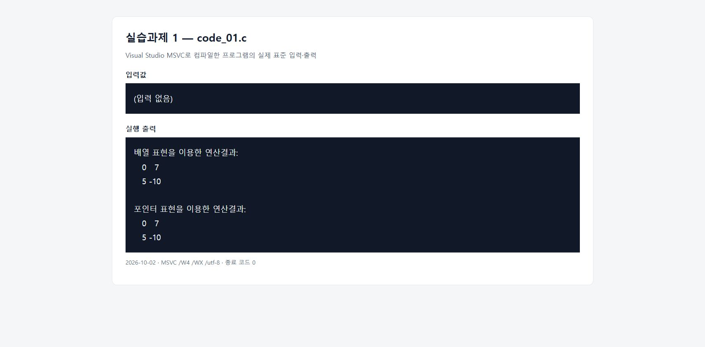
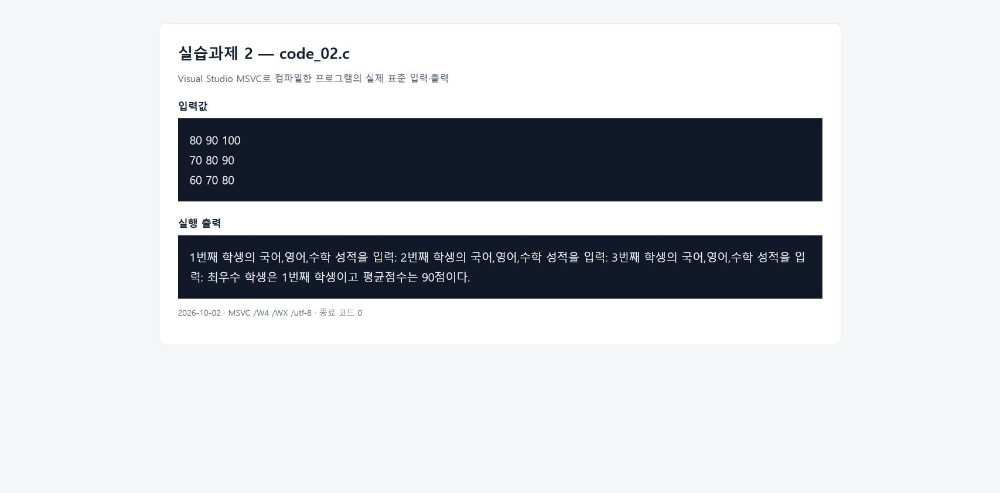
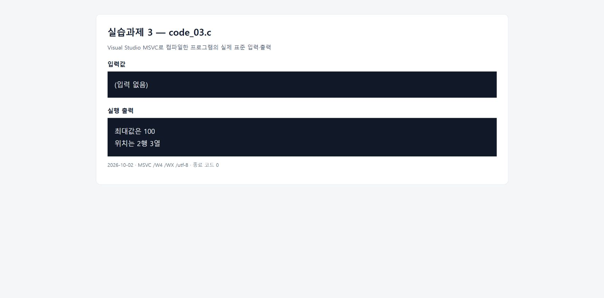
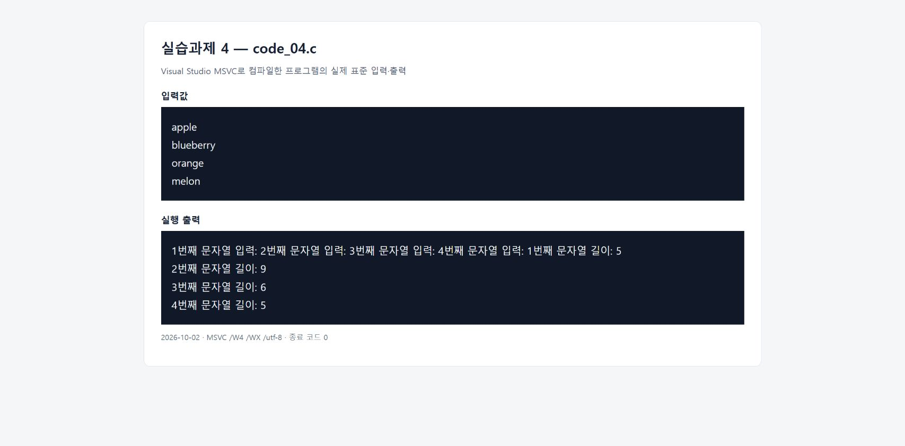
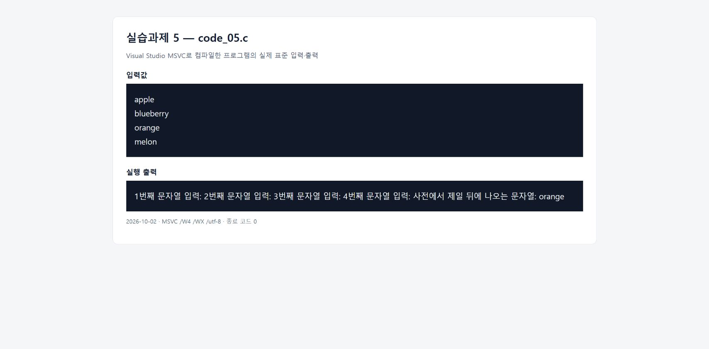

# 실습과제 1

## 문제

2차원 배열 3개를 선언하고 이중 반복문으로 행렬 덧셈을 수행한다. 배열 표현과 포인터 표현을 같은 프로그램에서 각각 사용한다.

```text
 2   4     -2   3      0    7
         +         =
 5  -5      0  -5      5  -10
```

## 소스코드 설명

[전체 소스코드](code_01.c)

```c
int a[2][2] = { { 2, 4 }, { 5, -5 } };
int b[2][2] = { { -2, 3 }, { 0, -5 } };
int result[2][2] = { 0 };
int i, j;
```

* a와 b에는 문제에 주어진 행렬을 저장하고, result는 덧셈 결과를 저장할 2차원 배열이다.
* 각 배열은 2행 2열이며, 결과 배열은 0으로 초기화한다.

```c
for (i = 0; i < 2; i++)
    for (j = 0; j < 2; j++)
        result[i][j] = a[i][j] + b[i][j];
```

* 바깥쪽 반복문은 행을, 안쪽 반복문은 열을 선택한다.
* 같은 위치의 두 요소를 더해 result[i][j]에 저장한다.

```c
*(*(result + i) + j) = *(*(a + i) + j) + *(*(b + i) + j);
```

* `a + i`는 i번째 행을 가리키고, `*(a + i) + j`는 그 행의 j번째 요소 주소이다.
* `*(*(a + i) + j)`는 `a[i][j]`와 같은 값을 나타낸다. b와 result에도 같은 원리를 적용한다.
* 배열 표현과 포인터 표현을 주석으로 나누어 한 코드 안에서 모두 계산하고 출력한다.

# 실행결과



MSVC로 실제 실행한 프로그램의 표준 입력과 출력을 결과 확인 페이지에 표시한 화면이다. 입력값과 출력은 구분하여 표시했으며, Visual Studio 콘솔 화면을 캡처한 이미지는 아니다.

&nbsp;

# 실습과제 2

## 문제

학생 3명의 국어, 영어, 수학 점수를 입력받아 각 학생의 평균을 구한 뒤, 최우수 학생의 순번과 평균점수를 출력한다.

## 소스코드 설명

[전체 소스코드](code_02.c)

```c
int score[3][3];
double average[3];
int i, j, total, best = 0;
```

* score의 행은 학생, 열은 국어·영어·수학 점수를 뜻한다.
* average에는 각 학생의 평균을 저장하고, best에는 최우수 학생의 배열 인덱스를 저장한다.

```c
printf("%d번째 학생의 국어,영어,수학 성적을 입력: ", i + 1);
total = 0;
for (j = 0; j < 3; j++)
{
    if (scanf("%d", &score[i][j]) != 1)
        return 1;
    if (score[i][j] < 0 || score[i][j] > 100)
    {
        printf("성적은 0부터 100 사이의 정수를 입력하시오.\n");
        return 1;
    }
    total += score[i][j];
}
average[i] = total / 3.0;
```

* 학생마다 total을 0으로 초기화한 후 세 과목의 점수를 더한다.
* 3.0으로 나누어 정수 나눗셈으로 소수 부분이 사라지지 않게 한다.
* 정수 입력 실패 또는 0~100 범위를 벗어난 성적은 종료하여 잘못된 값으로 평균을 계산하지 않는다.

```c
for (i = 1; i < 3; i++)
    if (average[i] > average[best])
        best = i;
```

* 첫 학생을 기준으로 나머지 학생의 평균을 비교한다.
* 더 높은 평균이 있으면 best를 바꾼다. 평균이 같으면 먼저 입력한 학생을 선택한다.

```c
printf("최우수 학생은 %d번째 학생이고 평균점수는 %g점이다.\n",
    best + 1, average[best]);
```

* 배열 인덱스는 0부터 시작하므로 화면 순번은 best + 1로 출력한다.
* %g로 평균 90은 90으로, 소수 평균은 소수 부분을 포함하여 출력한다.

# 실행결과



MSVC로 실제 실행한 프로그램의 표준 입력과 출력을 결과 확인 페이지에 표시한 화면이다. 입력값과 출력은 구분하여 표시했으며, Visual Studio 콘솔 화면을 캡처한 이미지는 아니다.

&nbsp;

# 실습과제 3

## 문제

주어진 3행 3열 행렬을 2차원 배열에 저장하고, 원소 중 최대값과 그 위치를 구한다.

```text
 -5   2   35
-20   5  100
-75   5  -25
```

## 소스코드 설명

[전체 소스코드](code_03.c)

```c
int arr[3][3] = { { -5, 2, 35 }, { -20, 5, 100 }, { -75, 5, -25 } };
int max = arr[0][0];
int row = 0, column = 0;
int i, j;
```

* 문제의 행렬을 arr에 저장하고 첫 번째 원소를 초기 최대값으로 정한다.
* 0으로 초기화하지 않으므로 모든 원소가 음수인 경우에도 비교 원리가 맞는다.
* row와 column에는 현재 최대값이 있는 행과 열 인덱스를 저장한다.

```c
for (i = 0; i < 3; i++)
    for (j = 0; j < 3; j++)
        if (arr[i][j] > max)
        {
            max = arr[i][j];
            row = i;
            column = j;
        }
```

* 이중 반복문으로 9개 원소를 검사한다.
* 더 큰 값을 찾으면 최대값과 행·열 위치를 함께 바꾼다. 같은 최대값이 여러 개이면 먼저 발견한 위치를 유지한다.

```c
printf("최대값은 %d\n", max);
printf("위치는 %d행 %d열\n", row + 1, column + 1);
```

* 최대값 100을 출력하고 행·열 인덱스에 1을 더해 2행 3열로 표시한다.

# 실행결과



MSVC로 실제 실행한 프로그램의 표준 입력과 출력을 결과 확인 페이지에 표시한 화면이다. 입력값과 출력은 구분하여 표시했으며, Visual Studio 콘솔 화면을 캡처한 이미지는 아니다.

&nbsp;

# 실습과제 4

## 문제

char str[4][10]에 문자열 4개를 입력받고, 문자열의 길이를 구하는 라이브러리 함수 없이 각 문자열의 길이를 직접 계산한다.

## 소스코드 설명

[전체 소스코드](code_04.c)

```c
char str[4][10];
int i, length;
```

* 행마다 문자열 하나를 저장한다. 각 행은 널 문자를 포함해 10바이트이다.
* 예제와 같이 공백 없는 영문 문자열을 최대 9글자까지 입력한다.

```c
for (i = 0; i < 4; i++)
{
    printf("%d번째 문자열 입력: ", i + 1);
    if (scanf("%9s", &str[i][0]) != 1)
        return 1;
}
```

* &str[i][0]은 i번째 문자열을 저장할 행의 시작 주소이다.
* %9s는 최대 9문자를 읽고 마지막에 널 문자를 저장하므로 배열 크기를 넘지 않게 한다. 입력 문자열은 9글자 이내로 입력한다.

```c
length = 0;
while (str[i][length] != '\0')
    length++;
printf("%d번째 문자열 길이: %d\n", i + 1, length);
```

* 각 문자열마다 length를 0으로 초기화한다.
* 문자열 끝을 나타내는 \0을 만날 때까지 한 글자씩 검사하면서 length를 증가시킨다.
* 널 문자는 길이에 포함하지 않고 strlen도 사용하지 않는다.

# 실행결과



MSVC로 실제 실행한 프로그램의 표준 입력과 출력을 결과 확인 페이지에 표시한 화면이다. 입력값과 출력은 구분하여 표시했으며, Visual Studio 콘솔 화면을 캡처한 이미지는 아니다.

&nbsp;

# 실습과제 5

## 문제

문자열 4개를 입력받고 사전에서 제일 뒤에 나오는 문자열을 출력한다. 과제 조건대로 라이브러리 함수 없이 문자열의 첫 문자만 비교한다.

## 소스코드 설명

[전체 소스코드](code_05.c)

```c
char str[4][10];
int i, last = 0;
```

* 문자열을 저장할 2차원 배열과 마지막 문자열의 인덱스 last를 선언한다.
* 처음에는 첫 문자열을 비교 기준으로 정한다.

```c
for (i = 0; i < 4; i++)
{
    printf("%d번째 문자열 입력: ", i + 1);
    if (scanf("%9s", &str[i][0]) != 1)
        return 1;
}
```

* 각 행의 시작 주소에 문자열을 입력한다. 영문 소문자로 시작하는 공백 없는 문자열을 9글자 이내로 입력한다.
* %9s로 끝의 널 문자 공간을 확보한다.

```c
for (i = 1; i < 4; i++)
    if (str[i][0] > str[last][0])
        last = i;
```

* 각 문자열의 첫 문자 str[i][0]을 현재 기준의 첫 문자와 비교한다.
* 더 큰 첫 문자를 찾으면 last를 바꾼다. 예시에서는 o가 a, b, m보다 뒤에 있으므로 orange를 선택한다.
* strcmp는 사용하지 않는다. 첫 문자가 같으면 먼저 입력한 문자열을 유지한다. 이 코드는 과제의 첫 문자 비교 조건을 따르며, 첫 문자가 같은 단어의 전체 사전 순서를 판별하지는 않는다.

```c
printf("사전에서 제일 뒤에 나오는 문자열: %s\n", &str[last][0]);
```

* 선택한 행의 시작 주소를 %s에 전달하여 문자열 전체를 출력한다.

# 실행결과



MSVC로 실제 실행한 프로그램의 표준 입력과 출력을 결과 확인 페이지에 표시한 화면이다. 입력값과 출력은 구분하여 표시했으며, Visual Studio 콘솔 화면을 캡처한 이미지는 아니다.

&nbsp;

## Visual Studio 실행 방법

[Visual Studio 실행용 ZIP](https://github.com/rkddmldyd/Cprogramming/raw/refs/heads/main/ch016/16-01/Ch16_01_%EA%B3%BC%EC%A0%9C.zip)을 내려받아 압축을 푼 뒤, VisualStudio_Ch16_01 폴더의 Ch16_01.sln을 연다.

각 코드에는 main 함수가 하나씩 있으므로 한 프로젝트에 5개를 동시에 추가하지 않는다. 함께 제공한 Visual Studio 솔루션을 열고 실행할 Code01~Code05 프로젝트를 우클릭하여 **시작 프로젝트로 설정**한 뒤 **Ctrl+F5**로 실행한다.

* Code01, Code03은 입력 없이 실행한다.
* Code02는 각 학생의 성적 3개씩 입력한다.
* Code04, Code05는 문자열을 한 개씩 총 4개 입력한다.
* 소스 파일만 직접 사용할 때는 빈 콘솔 프로젝트에 원하는 .c 파일 하나를 추가한다. 한글이 깨지면 소스의 문자 집합과 실행 문자 집합을 UTF-8로 설정하고, 실행 터미널도 UTF-8로 사용한다.
